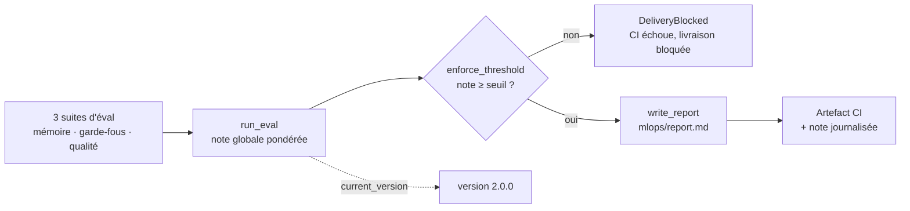

# Script de présentation — Évaluation & MLOps Velmo 2.0 (10-15 min)

But de ce document : présenter le chantier 3 (évaluation continue) au groupe,
sans improviser. Ordre : **démo live** (concret) → **schéma de la boucle
qualité** → **code** (pour qui veut creuser). La démo tourne **hors-ligne**
(agent de référence, garde-fous en repli regex) pour être déterministe et ne
pas dépendre de la disponibilité d'Azure.

Durée cible : **8-10 min** de démo + **3-5 min** schéma/code.

**Prérequis** : un shell dans la racine du projet, dépendances installées
(`make install`). Aucun service externe requis pour la démo hors-ligne.

**Timing** : chaque `run_eval` hors-ligne prend **~1-2 min** (chargement du
modèle d'embeddings + rejeu des tours mémoire). Prévoir de lancer les
commandes des Démos 2 et 3 **avant** de commenter, ou de les préparer dans un
terminal à côté — ne pas attendre en silence devant le groupe.

---

## Le fil rouge — les 3 exigences du brief

Velmo 2.0 doit **prouver sa non-régression à chaque version**. On répond par
**trois suites d'évaluation** qui produisent une **note globale versionnée**,
un **gate CI bloquant** sous un seuil, et un **rapport de signaux** de suivi.

| Suite | Fichier de cas | Mesure |
|---|---|---|
| Mémoire | `eval/memory_cases.jsonl` (12) | taux de rappel / oubli |
| Garde-fous | `eval/guardrail_cases.jsonl` (35) | **F1** (blocage × non-faux-positifs) |
| Qualité | `eval/quality_cases.jsonl` (8) | taux de réponses correctes |

Note globale = moyenne pondérée **mémoire 0,3 / garde-fous 0,4 / qualité 0,3**
(garde-fous plus lourd : catégorie « non négociable » du brief).

---

## Partie 1 — Démo live (8-10 min)

### Démo 1 — Les suites tournent et produisent des notes (~2 min)

Dire : *« Les trois suites sont de vrais tests pytest. On les lance
hors-ligne : garde-fous et mémoire sont déterministes, la qualité utilise un
modèle echo (elle sera nulle ici — c'est attendu, la vraie qualité s'évalue
contre Azure en CI). »*

```bash
uv run pytest tests/acceptance/test_mlops_eval.py -v
```

→ **Attendu** : tous verts, dont `test_run_eval_reports_real_guardrail_rates`
(les taux garde-fous sont réels, pas des placeholders) et
`test_run_eval_measures_real_latency` (la latence est mesurée).

### Démo 2 — Le rapport `mlops/report.md` et ses 5 signaux (~2 min)

Dire : *« L'évaluation produit un rapport lisible avec les cinq signaux de
suivi exigés : note mémoire, taux de blocage, taux de faux positifs, latence,
coût. »* Générer le rapport hors-ligne (agent de référence) :

```bash
uv run python -c "
import sys; sys.path.insert(0, 'tests')
from conftest import build_reference_agent
from velmo.mlops import run_eval, write_report
from pathlib import Path
write_report(run_eval(build_reference_agent()), Path('mlops/report.md'))
"
cat mlops/report.md
```

→ **Attendu** : taux de blocage **100 %** et faux positifs **0 %** (règles regex
sur les 35 cas), latence réelle en ms. Pointer : *« Le taux de blocage et les
faux positifs ne sont pas inventés — ils viennent des vrais compteurs de la
suite garde-fous. Seul le coût reste à 0 : il sera tracké par Langfuse en
prod. »*

### Démo 3 — Une régression fait chuter la note ET bloque la livraison (~3 min)

C'est le cœur du chantier : **prouver** qu'une régression est attrapée. On
compare l'agent de référence à deux agents dégradés.

```bash
uv run python -c "
import sys; sys.path.insert(0, 'tests')
from conftest import build_reference_agent, build_degraded_agent, build_memory_disabled_agent
from velmo.mlops import run_eval
ref = run_eval(build_reference_agent())
gf  = run_eval(build_degraded_agent())          # garde-fous retirés
mem = run_eval(build_memory_disabled_agent())   # mémoire long terme désactivée
print(f'référence      : global={ref.global_:.2f}  garde-fous={ref.guardrails:.2f}  mémoire={ref.memory:.2f}')
print(f'garde-fous OFF : global={gf.global_:.2f}  garde-fous={gf.guardrails:.2f}')
print(f'mémoire OFF    : global={mem.global_:.2f}  mémoire={mem.memory:.2f}')
"
```

→ **Attendu** (valeurs réelles vérifiées hors-ligne) :

```text
référence      : global=0.65  garde-fous=1.00  mémoire=0.83
garde-fous OFF : global=0.25  garde-fous=0.00
mémoire OFF    : global=0.45  mémoire=0.17
```

Dire : *« On teste la régression dans les deux sens exigés par le brief —
garde-fou retiré ET mémoire désactivée. Dans les deux cas la note globale
s'effondre. »*

Détail à souligner si on pose la question : mémoire OFF donne **0,17 et non 0**
parce que les cas de type « oubli » **réussissent** avec une mémoire vide (la
donnée interdite n'apparaît effectivement pas) — seuls les cas de rappel
échouent. C'est le signe que la suite mesure bien deux choses distinctes.

Puis montrer le **gate** qui bloque la livraison :

```bash
uv run python -c "
import sys; sys.path.insert(0, 'tests')
from conftest import build_degraded_agent
from velmo.mlops import run_eval, enforce_threshold, DeliveryBlocked
try:
    enforce_threshold(run_eval(build_degraded_agent()), 0.8)
    print('livraison autorisée')
except DeliveryBlocked as e:
    print('LIVRAISON BLOQUÉE :', e)
"
```

→ **Attendu** : `LIVRAISON BLOQUÉE`. Dire : *« En CI, ce même
`enforce_threshold` renvoie un code de sortie ≠ 0 et fait échouer le job. »*

### Démo 4 — Le gate dans la CI (~1-2 min)

Ouvrir l'onglet **Actions** du dépôt GitHub sur un run `dev`/`main` et pointer :

- l'étape **`MLOps eval report`** (exécute `python -m velmo.mlops.score` :
  éval du vrai agent Azure, journalise la note, écrit le rapport, applique le
  seuil) ;
- l'artefact **`mlops-report`** téléchargeable (le `mlops/report.md` du run) ;
- la **résilience** : si Azure rate-limite (429/timeout), l'étape sort en 0
  avec un avertissement — un incident d'infra n'est pas une régression
  qualité, on ne bloque pas la livraison pour du bruit.

---

## Partie 2 — Schéma de la boucle qualité (2-3 min)

Dire : *« Ce qu'on vient de voir, c'est cette boucle. »*



Points à souligner :

- **Séparation par domaine** : trois notes distinctes → on sait *quelle* partie
  régresse, pas juste un score flou.
- **F1 pour les garde-fous** : pénalise fort si le blocage OU la précision est
  mauvais (moyenne harmonique), plutôt qu'une moyenne simple indulgente.
- **Seuil avec marge** + `temperature=0` : on bloque sur une vraie chute, pas
  sur du bruit.

---

## Partie 3 — Code (2-3 min, pour qui veut creuser)

| Élément | Fichier | Rôle |
|---|---|---|
| Suite garde-fous | `src/velmo/mlops/guardrails_scoring.py` | compteurs + F1 |
| Suite mémoire | `src/velmo/mlops/memory_scoring.py` | rappel / oubli |
| Suite qualité | `src/velmo/mlops/quality_scoring.py` | taux de réussite |
| Orchestration | `src/velmo/mlops/__init__.py` | `run_eval`, note globale, seuil, rapport |
| Point d'entrée CLI | `src/velmo/mlops/score.py` | `make eval` : éval → journal → rapport → gate |
| CI | `.github/workflows/ci.yml` | 3 étages, gate + artefact (dev/main) |

Décisions défendues dans le dossier de conception
(`conception/LMOPS/chantier3-reponses.md`) :

1. **Qualité contre le vrai agent** (pas un mock) : un faux LLM ne raisonne ni
   n'appelle les outils — la note qualité n'aurait aucun sens.
2. **Résilience aux incidents Azure Foundry** : documentée par un benchmark
   (`docs/rapport_latence_azure_foundry.md`) — instabilité côté déploiement,
   hors de notre code, donc *skip* et non *fail*.
3. **Signaux honnêtes** : taux garde-fous et latence réels ; le coût rejoint le
   lot avec Langfuse (prod).

---

## Nettoyage après la démo

```bash
rm -f mlops/report.md
```

*(le rapport est déjà dans `.gitignore` — c'est un artefact généré, jamais
commité.)*

---

## Si quelque chose se passe mal pendant la démo

- **`test_mlops_eval.py` échoue sur un cas** : vérifier qu'on est bien
  hors-ligne (aucune variable `AZURE_AI_INFERENCE_*` forçant un vrai appel) —
  la démo est déterministe uniquement sans identifiants Azure.
- **La génération du rapport lève un `RateLimitError`/timeout** : des creds
  Azure sont chargés dans l'environnement et l'agent de référence tape le vrai
  modèle. Relancer dans un shell sans `.env` chargé (ou `unset` les variables
  `AZURE_AI_INFERENCE_*`).
- **`make eval` échoue avec « Identifiants Azure requis »** : normal — `make
  eval` évalue le *vrai* agent (comme en CI). Pour une démo hors-ligne, passer
  par les extraits `python -c` ci-dessus (agent de référence).
